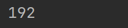
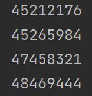

# Лабораторная работа №6
## Сложность: Rare
## Вариант №2
### Задание
1. Напишите программу для решения задач своего варианта.
2. Оформите отчёт в README.md. Отчёт должен содержать:
    - Условия задач
    - Описание проделанной работы
    - Скриншоты результатов
    - Ссылки на используемые материалы
### Ход работы    
1. Ольга составляет таблицу кодовых слов для передачи сообщений, каждому сообщению соответствует своё кодовое слово. В качестве кодовых слов Ольга использует 4-буквенные слова, в которых есть только буквы A, B, C, D, X, Y, Z. При этом первая буква кодового слова — это буква X, Y или Z, а далее в кодовом слове буквы X, Y и Z не встречаются. Сколько различных кодовых слов может использовать Ольга?
```python
count = 0

for letter1 in ['X', 'Y', 'Z']:
    for letter2 in ['A', 'B', 'C', 'D']:
        for letter3 in ['A', 'B', 'C', 'D']:
            for letter4 in ['A', 'B', 'C', 'D']:
                word = letter1 + letter2 + letter3 + letter4
                count += 1

print(count)
```
- Иллюстрация решения задачи 1



2. Значение арифметического выражения $9^8 + 3^5 - 9$ записали в системе счисления с основанием $3$. Сколько цифр $2$ содержится в этой записи?
```python
x = 9**8 + 3**5 - 9
a = []
while x > 0:
    a = [x % 3] + a
    x = x//3
print(a.count(2))
```
- Иллюстрация решения задачи 2


3. Найдите все натуральные числа, принадлежащие отрезку [45000000; 50000000], у которых ровно пять различных нечётных делителей (количество чётных делителей может быть любым). Выведите найденные числа в порядке возрастания.
```python
def isOddNumberPrime(n):
    for x in range(3, n, 2):
        if x*x > n:
            return True
        if n % x == 0:
            return False

p = [x for x in range(3, 100, 2) if isOddNumberPrime(x)]
p4s = {x**4 for x in p}

for n in range(45000000, 50000000 + 1):
    x = n
    while (x & 1) == 0:
        x >>= 1
    if x in p4s:
        print(n)
```
- Иллюстрация решения задачи 3



### Ссылки на используемые материалы
https://evil-teacher.on.fleek.co/prog_pm/lab06/
https://otvet.mail.ru/question/225218959# lab06
